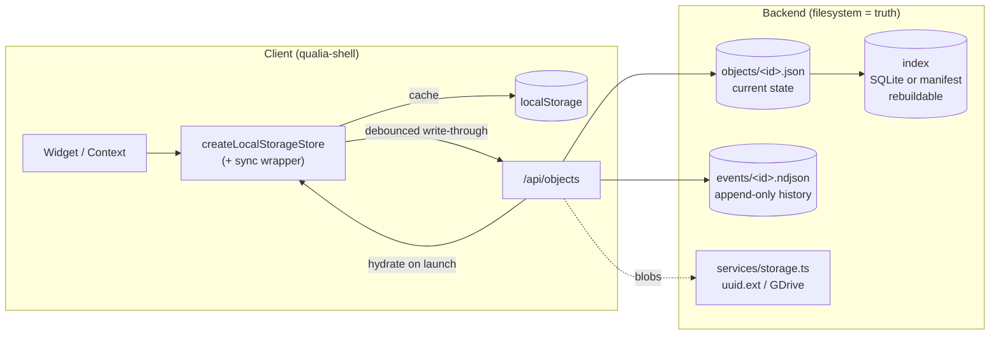

# Dwellium — One Save (Persistence Spine) Design

**Status:** Draft for review · **Date:** 2026-06-09 · **Owner:** Ilya
**Goal:** Make the proposal's hard requirement true *by architecture, not discipline*: **anything a user puts into Dwellium is retrievable and permanent.**

---

## 1. Executive summary

Today Dwellium persists in two disconnected ways:

- **Backend (durable):** uploaded file **blobs** go to `services/storage.ts` (local filesystem `uuid.ext`, or Google Drive), and some records live in backend `src/stores/*`. This is real, durable, source-of-truth storage.
- **Frontend (fragile):** **40** `createLocalStorageStore` stores write **only to `localStorage`** — there is **no backend write-through**. Clear browser data, switch device, or use a different browser, and that data is **gone**.

About half of those 40 stores hold genuine **user content** (Foundry items, Wiki, Synthesis, ThoughtWeaver captures, CoPaw/Honcho memory, tags, reports, task boards, todos, custom editor themes, voice library) — and one holds **API keys** (`integrationsStore`). None of it is guaranteed to survive.

**One Save** closes the gap with a single backend **object store** + **append-only event log**, a thin **write-through** layer on the existing `createLocalStorageStore` factory (localStorage demoted to a cache), and a one-time **migration** that backfills the 40 stores. It reuses what already exists — the blob storage, the per-user dynamic-key pattern, the "filesystem is truth / DB is a rebuildable index" principle — so it is an additive layer, **not a rewrite**.

---

## 2. Verified current state

Evidence (run 2026-06-09 against `qualia-shell/src` and `dwellium-backend/ai-dashboard369-file-manager/src`):

- `grep -rEn "export const … = createLocalStorageStore" src | wc -l` → **40** stores.
- `createLocalStorageStore.ts` — `set(next, persistToStorage)` calls a caller-supplied `persistToStorage()` that writes localStorage **only**; `getSnapshot()` reads localStorage; **no network**. Cross-tab sync explicitly unsupported.
- Backend `services/storage.ts` — blob abstraction: `uploadToStorage` → `STORAGE_DIR/<uuid><ext>` (or Google Drive), md5 checksum, `download/stream/delete/exists/stats`. **The file is the source of truth.**
- Backend record layer `src/stores/*` (taskStore, inboxStore, dwelliumStore, thoughtWeaverStore, settingsStore, assetStore, notebooklmStore, auditLogStore, …) — **mixed** persistence (some JSON-on-disk like `settingsStore`/`notebooklmStore`; others may be in-memory — *confirm per store before relying on them*).
- `/api/*` surface is broad: `files, inbox, tasks, thought-weaver, settings, assets, dwellium, accounting, integrations, ara, intelligence, …`.

### 2.1 The 40 frontend stores, classified

> Classification is by name/type; **confirm each store's payload semantics before cutover** (I inventoried names + the factory, not all 40 bodies).

| Class | Count | Stores | Loss impact |
|---|---:|---|---|
| **UI preferences / chrome** | ~13 | `themeStore`, `fontPairingStore`, `accentColorStore`, `animationsEnabledStore`, `domainsCollapsedStore`, `iconOnlyStore`, `sidebarGroupsStore`, `sidebarSplitStore`, `sidebarWidthStore`, `gridLockStore`, `layoutSettingsStore`, `workspaceUiStore`, `dockItemsStore` | Annoyance — re-set a toggle. localStorage acceptable; sync = nice-to-have. |
| **Layouts / arrangement** | ~5 | `savedLayoutsStore`, `scribeLayoutStore`, `dashboardLayoutStore`, `hierarchyStore`, `activeThreadStore` | Lose your saved arrangement. Should sync. |
| **User CONTENT** | ~20 | `foundryStore`, `wikiStore`, `synthesisStore`, `thoughtWeaverStore`, `reportStore`, `copawStore`, `memoryStore` (Honcho), `dreamStore`, `hermesLearningStore`, `dumpStore`, `tagStore`, `priorityStore`, `taskBoardStore`, `todoStore`, `ingestionStore`, `scribeThemeStore`, `scribeCustomsStore`, `speakerLibraryStore`, `speakerSettingsStore`, `fileExplorerStore` | **Permanent data loss.** This is the requirement violation. |
| **Sensitive** | 2 | `integrationsStore` (per-user LLM/Supabase/Postgres **API keys**), `tokenStore` (auth) | `integrationsStore`: lost on clear + not portable across devices → needs **encrypted** backend persistence or an explicit "client-only" decision. `tokenStore`: **keep client-only** (do *not* sync). |

---

## 3. The risk, concretely

- A user writes a Wiki page, builds a Foundry item, captures 50 ThoughtWeaver notes, trains CoPaw memory → all live in `localStorage` for *that browser only*. Reinstall, new laptop, or "Clear site data" → **all gone, unrecoverably.**
- `integrationsStore` keeps API keys in plaintext `localStorage` — both a **loss** risk (re-enter keys per device) and a mild **exposure** surface.
- ThoughtWeaver already has a *backend* `stores/thoughtWeaverStore.ts`, but the client persists locally — so the two can silently diverge. Inconsistent half-coverage is its own bug class.

---

## 4. The One Save architecture

One rule, enforced everywhere: **every user-created object is written through to the backend object store and indexed; `localStorage` is only a cache.**



### 4.1 Object model

Every persisted thing is an **Object**:

```jsonc
{
  "id": "obj_01H...",          // stable, server- or client-minted (ULID)
  "type": "wiki|foundry|capture|layout|setting|memory|tag|report|...",
  "ownerId": "user_andy",      // per-user; or "shared" for org-wide
  "schema": 1,                  // payload version for safe migration
  "createdAt": "...", "updatedAt": "...",
  "deletedAt": null,            // soft-delete tombstone (never hard-drop silently)
  "blobKeys": ["<uuid.ext>"],  // optional: links to storage.ts blobs
  "payload": { /* the store's value, unchanged */ }
}
```

### 4.2 Append-only event log

Each object has an `events/<id>.ndjson` — one line per edit (`create|update|delete|restore`, with a diff or full snapshot). This gives, for free: full history, **undo**, audit trail, and conflict reconstruction. The `objects/<id>.json` is a materialized "current state" projection (rebuildable by replaying events).

### 4.3 Index, don't store-of-record

A lightweight **index** (SQLite table, or a JSON manifest) over `objects/` powers list/search/filter. It is **rebuildable** by scanning the object dir — matching the repo's existing "filesystem is truth, DB is a rebuildable index" principle (see `CLAUDE.md`). Losing the index is never data loss.

### 4.4 Restore everything on launch

On login, the client hydrates each store from `GET /api/objects?type=…&owner=…` and seeds `localStorage` from the result. Open files, layouts, chat history, captures, settings, memory — all rehydrate. The existing per-user dynamic-key namespacing (`integrationsUserIdHolder`, `savedLayoutsUserIdHolder`) maps cleanly to `ownerId`.

### 4.5 Never silently drop

Deletes are **soft** (tombstone event + `deletedAt`); purge only on explicit user action ("user-only delete", per the ThoughtWeaver carry-forward ask). Backend failure **never** loses the write: the client keeps the value in its localStorage cache and retries (offline-first), surfacing the existing `BackendConnectionBanner` reconnect affordance — consistent with the repo's "backend failure never logs you out" rule.

---

## 5. Client integration (minimal, additive)

Extend the existing factory rather than replace it. Add an **optional** sync config:

```ts
createLocalStorageStore<T>({
  key: () => `wiki_${userId()}`,
  deserializer, defaultValue,
  sync: {                          // NEW, optional — opt-in per store
    objectType: 'wiki',
    ownerId: () => userId(),
    debounceMs: 800,               // write-through after the user pauses
    toPayload: v => v,             // identity by default
  },
})
```

- `set()` keeps writing localStorage immediately (instant UX, offline cache) **and** schedules a debounced `PUT /api/objects/<id>`.
- A small `syncQueue` flushes on reconnect; failures never throw into React (cache holds the value).
- Stores **without** `sync` behave exactly as today (zero risk to the ~13 prefs we may choose to leave local).
- `tokenStore` deliberately gets **no** `sync`.

This preserves the SSR-safe `useSyncExternalStore` contract and the `.reset()` test convention untouched.

---

## 6. Migration (one-time, idempotent)

1. On first launch post-deploy, a `migrateLocalToSpine()` runs once (guarded by a `one_save_migrated_v1` flag object).
2. For each sync-enabled store, read the current `localStorage` value → `POST /api/objects` (upsert by deterministic id, so re-runs are safe).
3. Verify round-trip (`GET` back, compare) before marking the store "migrated."
4. Backend stores that already exist (e.g., `thoughtWeaverStore`) are **reconciled**, not duplicated — last-writer-wins on `updatedAt`, with both states preserved in the event log so nothing is lost.

No data is deleted from `localStorage` during migration — it becomes the cache.

---

## 7. Phased rollout (low-risk order)

| Phase | Scope | Risk | Est. |
|---|---|---|---|
| **P0 — Spine** | `/api/objects` (CRUD + list + event log) + index + blob linkage. No client cutover yet. Unit + round-trip tests. | Low (new, additive) | 3–5 days |
| **P1 — Content cutover** | Add `sync` to the ~20 **content** stores + `integrationsStore` (encrypted). Migration backfill. This is the requirement. | Med | 4–6 days |
| **P2 — Layout + pref sync** | Sync the 5 layout stores + (optionally) prefs so the workspace follows the user across devices. | Low | 2–3 days |
| **P3 — History/undo UI** | Surface the event log: per-object version history + restore (Scribe already has a `createVersion` notion to generalize). | Med | 3–5 days |

P0+P1 alone deliver "stays forever." P2/P3 are upside.

---

## 8. Risks & open questions

1. **Conflict resolution / offline merge.** Two devices edit the same object offline. Default: last-writer-wins on `updatedAt` + full history in the event log (nothing lost, even if a version is superseded). CRDT is out of scope for v1 — confirm acceptable.
2. **`integrationsStore` (API keys).** Encrypt at rest on the backend (the repo already has `services/domainEncryption.ts` — reuse it) keyed per user, or make a deliberate "client-only, never synced" decision. **Needs your call.**
3. **Per-user vs shared objects.** Some content may be org-wide (Wiki?) vs personal (todos). Need an `ownerId === 'shared'` convention + access rules. Confirm which types are shared.
4. **Backend store inconsistency.** Some `src/stores/*` are JSON-on-disk, some possibly in-memory. Audit each before the object store subsumes or coexists with them.
5. **Blob vs record.** Large artifacts (PDFs, audio) stay in `storage.ts` blobs; the Object holds metadata + `blobKeys`. Confirm the boundary (e.g., inline payloads capped at N KB).
6. **Storage growth + the 70 MB `nebula-bg.mp4` precedent.** Event logs grow; add compaction (snapshot + truncate) and per-owner quotas before it matters.
7. **Auth coupling.** Hydrate-on-launch depends on a known `userId`; confirm the login flow exposes it before first store read (it does today via `UserContext` → the dynamic-key holders).

---

## 9. What I verified for this doc

- `createLocalStorageStore` store count = **40** (grep, listed in §2.1).
- Factory is localStorage-only, no write-through (read `createLocalStorageStore.ts` in full).
- Backend `services/storage.ts` = blob fs/GDrive abstraction (read in full).
- `/api/*` mount table from `app.ts` (grepped).
- **Not yet verified (flagged above):** per-store payload semantics for all 40; which backend `src/stores/*` are disk- vs memory-backed. These are the first checks in P0.

---

*Next: on your go, I'll start P0 — scaffold `/api/objects` (CRUD + event log + index) in the backend and the `sync` wrapper on the factory, behind a flag, with round-trip tests — without touching the 40 stores until the spine is proven.*
