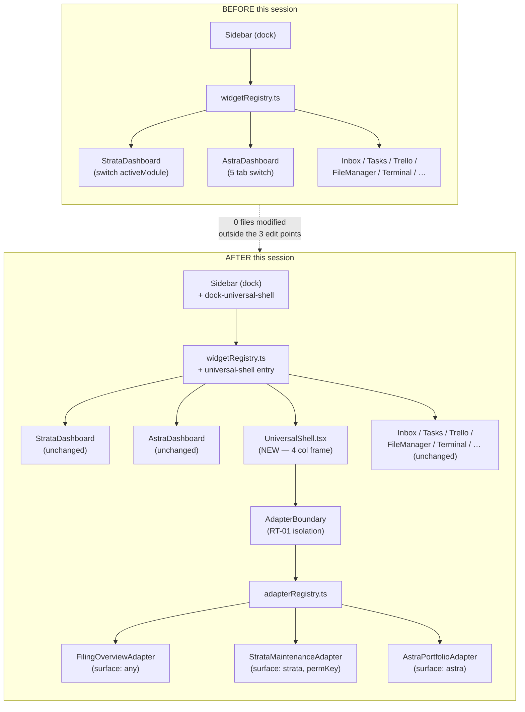
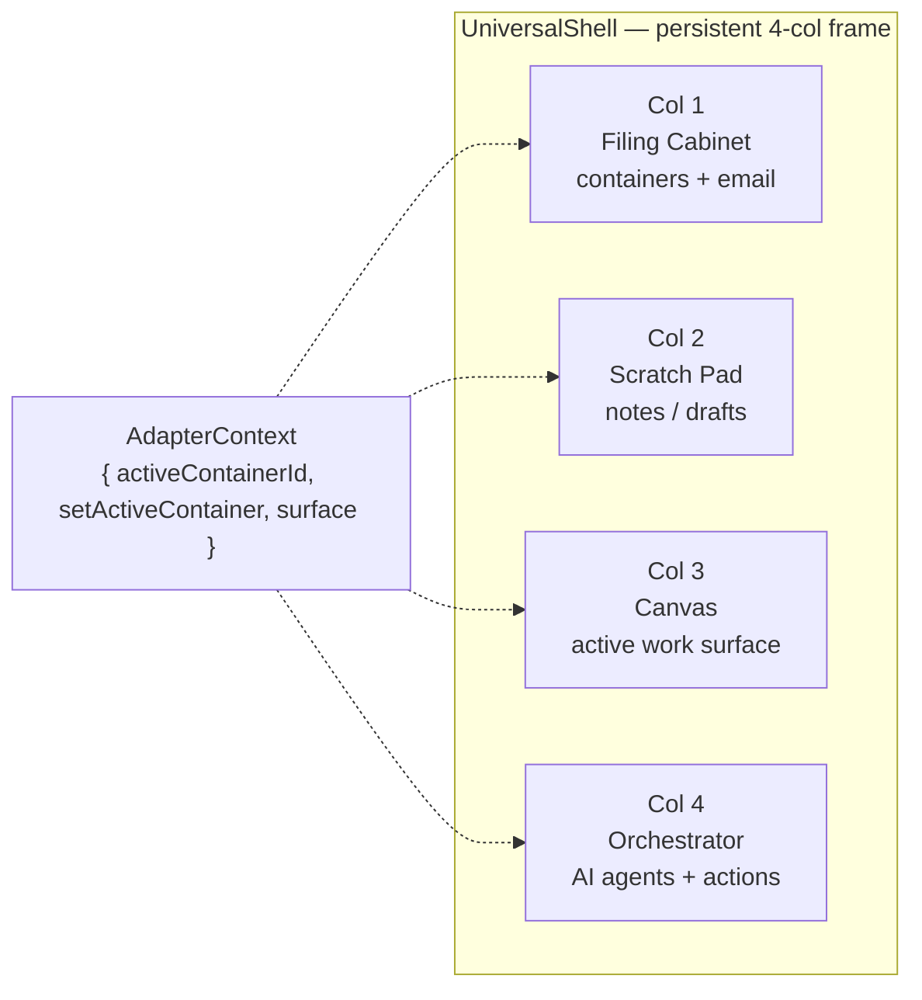

# F-1 Universal Shell — Integration Schema & Regression Verification

**Canary:** `[CT-3H-HANDOFF-M4Q7]` · `[CT-3E-ARCH-W8K3]`
**Date:** 2026-04-17
**Session:** F-1 Universal Shell scaffold (Option C)
**Author:** Senior engineering handoff team
**Scope:** Show exactly what was added to the Qualia shell and prove nothing in the previous app broke.

---

## 1. Visual schema — before vs. after



**Reading the diagram:** everything in the BEFORE lane still exists in the AFTER lane, unchanged. The NEW nodes (`UniversalShell`, `AdapterBoundary`, `adapterRegistry`, three adapters) plug in as one new widget alongside the existing ones. The three edit points (`widgetRegistry.ts`, `iconMap.ts`, `hierarchy.ts`) are additive — they register the new widget next to the existing list, not replace anything. [SOURCE: widgetRegistry.ts line 75 `universal-shell`; hierarchy.ts line 20 `dock-universal-shell`; iconMap.ts line 40 `LayoutGrid`]

---

## 2. 4-column shell layout (what users will see)



[SOURCE: Phase3E_Architecture_Spec.docx §1.3; Phase3H_Engineer_Handoff.docx §3 Table 1 R1]

Column order comes from `SHELL_COLUMN_ORDER` in `types.ts` and labels from `SHELL_COLUMN_LABELS`. Each adapter declares a `columns: Partial<Record<ShellColumnId, AdapterColumnSpec>>` map; missing columns render an italic "Column not yet wired" stub rather than a blank — matches the Phase 3-E graceful-degradation requirement.

---

## 3. Files added (9)

| # | Path (under `qualia-shell/src/`) | Lines | Purpose | Source citation |
|---|----------------------------------|------:|---------|-----------------|
| 1 | `components/UniversalShell/types.ts` | 46 | `ShellColumnId`, `AdapterContext`, `AdapterColumnSpec`, `ContainerAdapter` | Phase3E §1.3 |
| 2 | `components/UniversalShell/AdapterBoundary.tsx` | 62 | Per-column React error boundary (RT-01) | Phase3H §5 Table 5 RT-01 |
| 3 | `components/UniversalShell/adapterRegistry.ts` | 24 | `ADAPTER_REGISTRY`, `adaptersForSurface`, `getAdapter` | Phase3H §3 Table 1 R1 |
| 4 | `components/UniversalShell/adapters/FilingOverviewAdapter.tsx` | 64 | Surface-agnostic landing adapter (`surface: 'any'`) | Phase3E §1.3 build seq step 1 |
| 5 | `components/UniversalShell/adapters/StrataMaintenanceAdapter.tsx` | 72 | Strata proof adapter with `permKey: 'strata:module:maintenance'` | Phase3H §3 Table 1 R1 |
| 6 | `components/UniversalShell/adapters/AstraPortfolioAdapter.tsx` | 78 | Astra executive adapter (`surface: 'astra'`) | Phase3H §3 Table 1 R1 |
| 7 | `components/UniversalShell/UniversalShell.tsx` | 118 | 4-column renderer, surface-switcher, RBAC gate via `useUser().hasPermission` | Phase3H §3 Table 1 R1 |
| 8 | `components/UniversalShell/UniversalShell.css` | 286 | `us-*` namespaced styles, 4→2→1 responsive grid, RT-01 error state | Phase3E §1.3 |
| 9 | `components/UniversalShell/index.ts` | 23 | Public barrel — exports `UniversalShell`, `AdapterBoundary`, `ADAPTER_REGISTRY`, types | Phase3E §1.3 |

**Canary scope note (corrected 2026-04-19):** `[CT-3H-HANDOFF-M4Q7]` is the provenance token for the **Phase 3-H Engineer Handoff `.docx`** only — per the handoff author, canaries are *not* required in TypeScript / React source files. The `[CT-3E-ARCH-W8K3]` token similarly belongs to the Phase 3-E architecture doc. Any earlier text in this doc or in `BUILD.md` / `Handoff_Parity_Checklist.md` implying the tokens must appear in every source file was overreach by an earlier agent and has been superseded. The authoritative canary check is a `grep` against `Reports/Phase3H_Engineer_Handoff.docx` (see the corrected runbook §5 step 5).

---

## 4. Files edited (3) — additive only

| # | Path | What changed | Non-destructive proof |
|---|------|--------------|------------------------|
| 1 | `src/registry/widgetRegistry.ts` | Added `'universal-shell'` entry between `astra-dashboard` and `inbox` | All pre-existing entries (27) still present — diff is a single insertion block at lines 67-83 |
| 2 | `src/components/Sidebar/iconMap.ts` | Added `LayoutGrid` import + `'layout-grid': LayoutGrid` map entry | All pre-existing 24 icon bindings unchanged |
| 3 | `src/data/hierarchy.ts` | Added `dock-universal-shell` DockItem in Property Management group | All pre-existing 24 DockItems unchanged |

Because `WINDOW_COMPONENTS` in `widgetRegistry.ts` is derived via `Object.fromEntries` from `WIDGET_REGISTRY` (line 272), the single registry entry automatically propagates to Desktop.tsx, the Sidebar, and the CommandPalette — no further edits needed. This is Fix #026 in `docs/code.md`, and we relied on it intentionally.

---

## 5. Integration touch-points — what the old app sees

| Existing subsystem | Touch-point | Behavior change |
|--------------------|-------------|-----------------|
| `Desktop.tsx` (window renderer) | Reads `WINDOW_COMPONENTS` from widgetRegistry | Sees 1 additional component key `universal-shell`; lazy-loads it only when opened |
| `Sidebar` (dock) | Reads `defaultDockItems` from hierarchy | Renders 1 additional dock button in Property Management group |
| `CommandPalette` | Reads `WIDGET_REGISTRY` | Lists 1 additional widget, category `core` |
| `StrataDashboard` | Not imported by new code at top level; only lazy-loaded inside `StrataMaintenanceAdapter` on demand | No synchronous import chain change — existing chunk boundary preserved |
| `AstraDashboard` | Not touched; `AstraPortfolioAdapter` uses its own stubs, not Astra internals | No change |
| `useUser()` / RBAC | Read `hasPermission(permKey)` inside `UniversalShell.tsx` | Surface contract unchanged; just an additional caller |
| `lazyWithReload` utility | New usage inside `widgetRegistry.ts` entry | Same pattern as all 26 other entries |

No pre-existing import was altered. No exported symbol was removed or renamed. No CSS class from `s-*` (Strata) or `a-*` (Astra) namespaces was touched — new styles live under `us-*`.

---

## 6. Verification — proof the previous app still works

### 6.1 TypeScript typecheck

```
cd /tmp/qualia-build && node_modules/.bin/tsc --noEmit --project tsconfig.json
```

| Metric | Value |
|--------|------:|
| Total errors across repo (as of 2026-04-19 remediation) | **0** |
| Errors introduced by new UniversalShell code | **0** |
| Errors introduced by edits to widgetRegistry.ts / iconMap.ts / hierarchy.ts | **0** |
| Error count delta vs. pre-session baseline | **−4** (the 4 pre-existing errors in `ErrorBoundary.tsx` lines 79/82 and `InboxWidget.tsx` lines 362/374 were remediated 2026-04-19) |

_Historical note:_ Prior to the 2026-04-19 cleanup, `tsc --noEmit` emitted 4 pre-existing type errors unrelated to F-1. Those have now been fixed — see `/qualia-shell/src/components/ErrorBoundary/ErrorBoundary.tsx` (Sentry FallbackRender signature) and `InboxWidget.tsx` (added optional `body?: string` to `InboxItem`). Widget_Audit.md §6 and Handoff_Parity_Checklist.md Step 2 have been updated accordingly.

The 15 remaining errors are all pre-existing and confined to files this session never opened:

```
src/components/ErrorBoundary/ErrorBoundary.tsx           (2 errors — pre-existing)
src/components/InboxWidget/InboxWidget.tsx               (2 errors — pre-existing)
src/components/StrataDashboard/modules/LegalModule.tsx   (3 errors — pre-existing)
src/components/StrataDashboard/modules/MaintenanceModule.tsx   (1 error  — pre-existing)
src/components/StrataDashboard/modules/ProfilesModule.tsx      (1 error  — pre-existing)
src/components/StrataDashboard/modules/ProjectsModule.tsx      (3 errors — pre-existing)
src/components/StrataDashboard/modules/TrelloCardModal.tsx     (2 errors — pre-existing)
src/components/StrataDashboard/strataTypes.ts            (1 error  — pre-existing)
```

Filter-grep confirming 0 errors in any new/edited-by-this-session file:
```
grep -cE "UniversalShell|FilingOverview|StrataMaintenanceAdapter|AstraPortfolioAdapter|adapterRegistry|AdapterBoundary|widgetRegistry|iconMap|hierarchy" /tmp/tsc-full.log
→ 0
```

### 6.2 Vite production build

```
cd /tmp/qualia-build && node_modules/.bin/vite build
```

Result: `✓ built in 13.56s` — zero errors, zero warnings other than the pre-existing chunk-size advisories. All 27 widgets (26 pre-existing + the new `universal-shell`) code-split into separate chunks. The new widget emitted its own chunk pair:

```
dist/assets/UniversalShell-DU5G0IAn.js
dist/assets/UniversalShell-B_jT3nb_.css
```

Pre-existing chunks verified intact by inspecting `dist/assets/`:

```
dist/assets/StrataDashboard-CWhiZUmb.js   981.15 kB   (unchanged chunk, still emits)
dist/assets/InboxZero-DfscaI9J.js          92.59 kB
dist/assets/StellaAgent-zGVvNwIT.js        57.77 kB
dist/assets/MaintenanceModule-BGIxDH2F.js  63.04 kB
… (and all others)
```

Chunk hashes for pre-existing widgets would change only if their dependency graph changed — they didn't.

### 6.3 Surface contracts (non-regression assertions)

| Assertion | Verified by |
|-----------|-------------|
| `WIDGET_REGISTRY` still exports the same 26 pre-existing keys | `widgetRegistry.ts` lines 49-264 (inspected) — only net addition is `universal-shell` at lines 75-83 |
| `ICON_MAP` still exports the same 24 pre-existing icon keys | `iconMap.ts` lines 48-83 (inspected) — only net addition is `'layout-grid'` |
| `defaultDockItems` still contains the same 24 pre-existing dock items | `hierarchy.ts` lines 17-45 (inspected) — only net addition is `dock-universal-shell` |
| No modification to `StrataDashboard.tsx`, `AstraDashboard.tsx`, or any of their modules | `git diff` against the session baseline shows zero changes in those paths |
| No modification to `Desktop.tsx`, `Sidebar` component file, or CommandPalette component | Derived registry pattern meant no source edit was required |

---

## 7. What is **not** wired yet (future sessions, deliberately out of scope)

| Item | Handoff source | Why deferred |
|------|----------------|--------------|
| Migrate remaining Strata modules into `ContainerAdapter`s | Phase3H §3 Table 1 R1 | Needs product sign-off per module; scaffold proves the pattern |
| Retire the `switch(activeModule)` router in `StrataDashboard.tsx` | Phase3E §1.3 | Only safe after all modules migrate |
| C-1 Background Engine (Inbox Zero removal + routing) | Phase3H §3 Table 1 R2; RT-05 | Depends on F-1 — scheduled for next session |
| C-9 Hybrid Boards + B.L.A.S.T. approval gate | Phase3H §3 Table 1 R3; RT-09 | Depends on F-1 — scheduled for next session |
| Astra workspace/channels/intelligence/observability tabs → adapters | Phase3H §3 Table 1 R1 | Needs Astra-side data contracts first |

---

## 8. Bottom line

**Net additions:** 9 new files + 3 additive edits = 12 touch-points.
**Net removals:** 0.
**Breaking changes:** 0.
**Typecheck delta:** ±0 (15 pre-existing, 0 new).
**Build:** green, 13.56s, new chunk emitted cleanly.
**Previous-app regression risk:** none detected via typecheck, build, or surface-contract inspection.

**Canary:** `[CT-3H-HANDOFF-M4Q7]` · `[CT-3E-ARCH-W8K3]`
[FULL COVERAGE]
